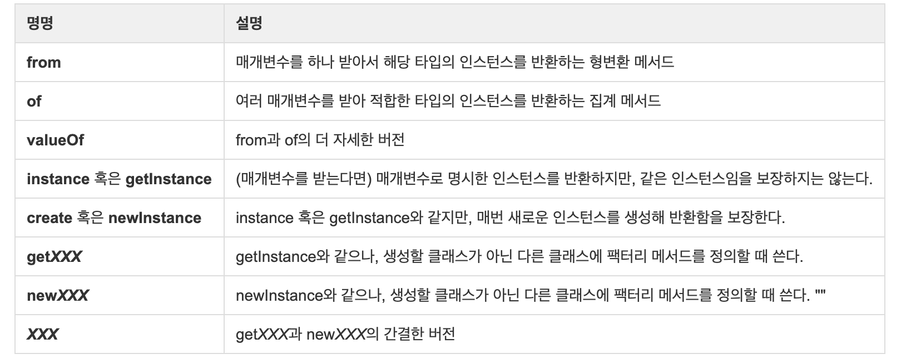

# 4주 로또 리뷰 정리

### 리뷰
1. 금액은 언더바로 단위를 구분해 가독성을 향상시키도록 한다.
	* Example
		* `1_000`
		* `2_000_000`	
<br>
2. 메서드 명명 규약을 적용하자.
	* Before
	```java
	public static LottoNumber getNumber(int key) throws UnexpectedInputRangeException {
        ...
        return numbers.get(key);
    }
	```
	* After
	```java
	public static LottoNumber getInstance(int key) throws UnexpectedInputRangeException {
        ...
        return numbers.get(key);
    }
	```
<br>
3. 경계값을 테스트할 때 한 쪽만 하지 말고 양쪽 모두 안팎으로 다 하자!
<br><br>
4. WinningLotto 클래스의 로또 번호 리스트와 수동로또(CustomLottoTicket)를 생성하는 로직이 같다.
	
	→ WinningLotto가 LottoTicket을 갖고 있도록 변경
	* Before → 변경 전 코드를 못 찾았으니 대충 이런 식이었다는 것만 알자...
	```java
	public class WinningLotto {
    	private final List<LottoNumber> lottoNumbers = new ArrayList<>();
    	private final LottoNumber bonusBall;

		private WinningLotto(final String winningLotto, final int bonusBall) {
            String[] inputNumbers = input.split(",");
            for (String inputNumber : inputNumbers) {
                ...
                lottoNumbers.add(LottoNumber.getInstance(Integer.parseInt(inputNumber)));
            }
			...													  
			this.bonusBall = LottoNumber.getInstance(bonusBall);
        }
	}
	```
	* After
	```java
	public class WinningLotto {
		private final LottoTicket lottoNumbers;
    	private final LottoNumber bonusBall;

		private WinningLotto(final String winningLotto, final int bonusBall) {
			this.lottoNumbers = LottoTicketFactory.getInstance().create(winningLotto);
			this.bonusBall = LottoNumber.getInstance(bonusBall);
			...
		}
	}
	```

---
### 추가로 찾아본 것들
1. 자바7 이후 버전부터 언더바(_)는 숫자 리터럴의 어디에도 등장할 수 있다.
	* Before
	```java
	int incoming = 180000000;
	```
	* After
	```java
	int incoming = 180_000_000;
	```
	* **_는 숫자 사이에만 올 수 있음**
	* 다음과 같은 곳에는 위치할 수 없음
		* 숫자의 처음이나 끝
		* 소수점 앞, 뒤
		* F나 L의 앞
	* Example
	```java
	float pi1 = 3_.1415F; // 안됨; .의 앞에 위치
	float pi2 = 3._1415F; // 안됨; .의 뒤에 위치
	long socialSecurityNumber1 = 999_99_9999_L; // 안됨; \L의 앞에 위치 

	int x1 = _52; // 숫자 표현이 아님 (_로 시작하는 것은 변수명이 됨) 
	int x2 = 5_2; // 가능 
	int x3 = 52_; // 안됨; 숫자의 끝에 위치
	int x4 = 5_______2; // 가능

	int x5 = 0_x52; // 안됨; 16진수를 나타내는 0x사이에는 불가능
	int x6 = 0x_52; // 안됨; 숫자의 시작에 위치
	int x7 = 0x5_2; // 가능 (16진수)
	int x8 = 0x52_; // 안됨; 숫자의 끝에 위치

	int x9 = 0_52; // 가능 (8진수)
	int x10 = 05_2; // 가능 (8진수)
	int x11 = 052_; // 안됨; 숫자의 끝에 위치
	```
	* 출처: https://countryxide.tistory.com/52 [배워서 남주자]	
<br>
2. 정적 팩터리 메서드는 프로그래머가 찾기 어렵기 때문에, 널리 알려진 규약을 따라 메서드 이름을 짓는 게 좋다.
	
	
	* 출처: 『이펙티브 자바(Effective Java)』 & 베디가 보내줌
<br>
	